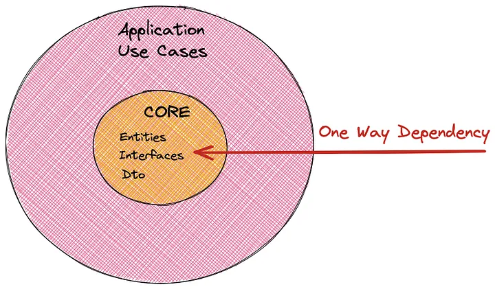

###  Explanation Of Clean Architecture

- **Layers**: Each ring represents an isolated layer in the application.
## 
- **Dependency**: The dependency direction is from the outside in. Meaning that the entities layer is independent and the frameworks layer (web, UI, etc.) depends on all the other layers.
## 
- **Entities**: Contains all the business entities that construct our application.
## 
- **Use cases**: This is where we centralize our logic. Each use case orchestrates all of the logic for a specific business use case (for example adding new customers to the system).
## 
- **Controllers and presenters**: Our controllers, presenters, and gateways are intermediate layers. You can think of them as an entry and exit gate to the use cases.
## 
- **Frameworks**: This layer has all the specific implementations. The database, the web frameworks, error handling frameworks, etc. Robert C. Martin describes this layer: “This layer is where all the details go. The web is a detail. The database is a detail. We keep these things on the outside where they can do little harm.”
##
### In the heart of the application, we have two layers:
## Entities layer: 
Contains all the business entities that construct our application.
## Use cases layer: 
Contains all the business scenarios that our application supports.


## Entities
The business entities in our app are:
```bash
export class User {
  id: number;
  email: string;
  password: string;
  // todos? :  Todo[]
  createdAt?: Date;
  updatedAt?: Date;

}
```
```bash
export class Todo {
  id: number;
  title: string;
  description: string;
  completed: boolean;
  userId: number;
  createdAt?: Date;
  updatedAt?: Date;

}
```

## Use Cases
This is where we centralize our logic. Each use case orchestrates all of the logic for a specific business use case.
- **Register a user**.
- **Login a user and return the token**
```bash
@Injectable()
export class UserUseCases {
  constructor(
    private dataServices: IDataServices,
    private userFactoryService: UserFactoryService,
  ) {}
  ...
  async register(createUserDto: CreateUserDto): Promise<User> {
    const user = await this.userFactoryService.createNewUser(createUserDto);
    return this.dataServices.user.register(user);
  }
  ...
```
- **Create a Todo**.
- **Get list of Todos**
```bash
@Injectable()
export class TodoUseCases {
  constructor(
    private dataServices: IDataServices,
    private todoFactoryService: TodoFactoryService,
  ) {}

  async createTodo(createTodoDto: CreateTodoDto): Promise<Todo> {
    if (!createTodoDto.userId) {
      throw new UserIdIsRequiredException();
    }
    if (!createTodoDto.title || createTodoDto.title.trim().length === 0) {
      throw new TodoTitleCannotBeEmpty();
    }
    const todo = this.todoFactoryService.createNewTodo(createTodoDto);
    const userNotExists = await this.dataServices.todo.checkUserExist(todo.userId);
    if (userNotExists) {
      throw new UserNotFoundException();
    }
    return this.dataServices.todo.createTodo(todo);
  }
  ...
```
## Services(Database)
The use case needs to persist the user details and check that it doesn’t exist in the system. 
This functionality can be implemented as a class that calls SQL 
##
With Abstractions we will define a contract between the use cases and the frameworks.
Basically, the contracts are the function signatures of the desired services.
For example, the Database service needs to provide 
a “create” function that create a User object as a parameter and returns a promise.
 
